<!-- PROFILE BANNER -->
<a href="https://github.com/djc1416">
  <picture>
    <source media="(prefers-color-scheme: dark)" srcset="assets/banner-dark.v9.svg">
    <source media="(prefers-color-scheme: light)" srcset="assets/banner-light.v9.svg">
    
  </picture>
</a>

 

---

## `$ whoami`

I'm David, an aspiring Computer Science Engineer from Chile interested in **cybersecurity, artificial intelligence, software development, and networking**.

I enjoy learning by building projects, experimenting with technologies, and understanding how systems work under the hood.

---

## $ cat tech-stack.yaml

| Area | Technologies |
|---|---|
| Programming | Python · C++ · JavaScript |
| AI & Automation | Python · AI · Automation |
| Tools | Git · GitHub · VS Code |
| Systems | Linux · Networking |
| Current Focus | Cybersecurity · Software · AI |>

---

## `$ python skills.py`

  <picture>
    <source media="(prefers-color-scheme: dark)" srcset="assets/radar-dark.svg">
    <source media="(prefers-color-scheme: light)" srcset="assets/radar-light.svg">
    
  </picture>

  <code>skill_radar: self-rated · status: learning</code>

---

## `$ ls projects/`

### MailGuardian AI
AI-assisted email analysis tool focused on grammar correction, tone suggestions, subject generation, and phishing detection.

**Python · Streamlit · AI**

### Discord Security WAF Bot
A Discord security bot with protection against message spam and suspicious links, including moderation and audit functionality.

**Python · Discord API · Security**

### RSA Learning Lab
An educational RSA implementation focused on understanding public-key cryptography and the mathematical foundations behind it.

**Python · Cryptography · Number Theory**

### Note&Cross
CLI task-management project created as part of Code in Place.

**Python · CLI**

---

## `$ connect --socials`

&nbsp;&nbsp;

 

  Learning, building and exploring technology from Chile 🇨🇱

